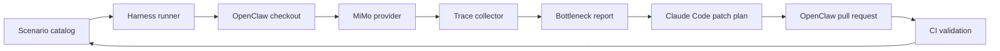

# Architecture

## Design goals

- Keep the benchmark inputs explicit and versioned.
- Separate measurement from analysis.
- Keep the patch plan small enough to review in one pass.
- Preserve a stable scenario set so regressions are comparable over time.

## Primary layers

### 1. Scenario layer

The scenario layer defines the exact stress patterns used to reproduce latency growth.
Examples include long-context conversations, tool-heavy loops, multi-turn planning, and format compatibility probes.

### 2. Trace layer

The trace layer records per-span latency and token movement.
It should be able to separate:

- LLM call latency.
- Context assembly and compaction latency.
- Plugin and event loop overhead.
- Gateway routing overhead.
- MiMo output normalization overhead.

### 3. Analysis layer

The analysis layer turns traces into a root-cause summary.
The output should answer three questions:

- What got slower?
- Which span grew the most?
- Which fix has the highest expected payoff?

### 4. Patch loop

The patch loop takes the smallest useful fix first.
That usually means one of the following:

- compaction fallback for non-cache providers,
- schema and heartbeat overhead reduction,
- faster normalization of `reasoning_content`,
- or a guard that prevents context from growing without bound.